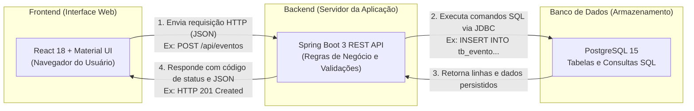
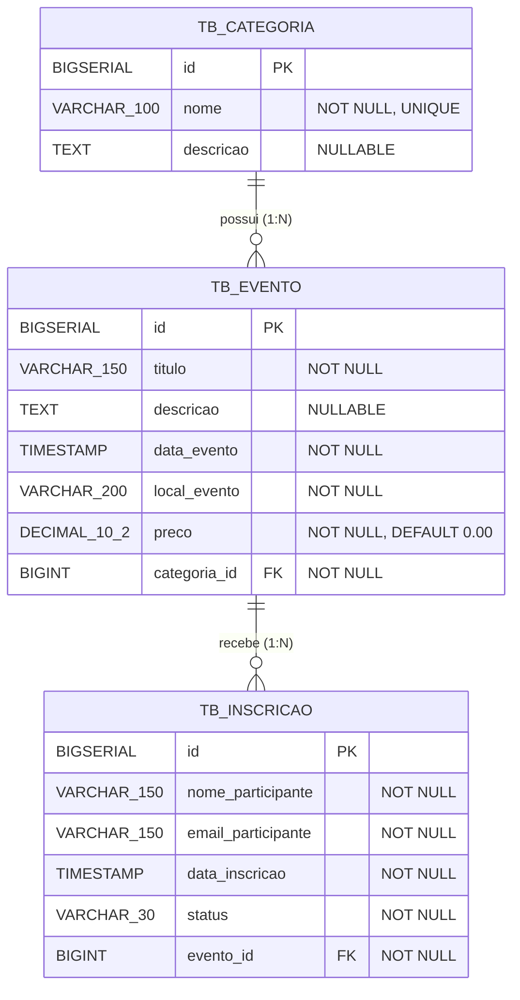

# Documentação Completa do Projeto

**Sistema de Gerenciamento de Eventos e Inscrições**  
**Autoria:** Trabalho Acadêmico de Banco de Dados  
**Tecnologias:** Java 17, Spring Boot 3, React 18, Vite, PostgreSQL 15, Material UI

---

## 1. Visão Geral do Projeto

### O que o sistema faz
O sistema é uma aplicação web completa desenvolvida para gerenciar **categorias**, **eventos** e **inscrições de participantes**, permitindo o cadastro, consulta, alteração e exclusão desses dados, além de emitir relatórios consolidados com cálculos financeiros e estatísticos gerados diretamente pelo banco de dados.

### Por que este domínio foi escolhido
O domínio de "Eventos e Inscrições" é ideal para a disciplina de Banco de Dados porque apresenta de forma natural:
1. **Relacionamentos bem definidos:** Uma categoria agrupa vários eventos (1:N), e um evento recebe várias inscrições de participantes (1:N).
2. **Regras de integridade referencial:** Um evento não pode existir sem uma categoria válida associada, e uma inscrição depende estritamente da existência prévia de um evento.
3. **Necessidade real de agregações complexas:** Em um cenário corporativo ou acadêmico, organizadores precisam saber quantos inscritos cada evento possui, a taxa de confirmação e a receita financeira acumulada por categoria — exigindo consultas SQL com agrupamentos (`GROUP BY`), junções (`LEFT JOIN`) e funções de agregação (`COUNT`, `SUM`, `AVG`, `COALESCE`).

### Mapa Visual da Arquitetura



- **Seta 1 (Frontend -> Backend):** O navegador envia uma mensagem pela rede no formato HTTP, contendo os dados digitados pelo usuário em formato JSON (texto estruturado).
- **Seta 2 (Backend -> Banco de Dados):** O Spring Boot valida os dados, aplica regras de negócio e traduz a solicitação em instruções SQL enviadas ao PostgreSQL.
- **Seta 3 (Banco de Dados -> Backend):** O PostgreSQL executa o comando no disco e devolve as linhas correspondentes ou a confirmação de sucesso da transação.
- **Seta 4 (Backend -> Frontend):** O Spring Boot empacota os dados recebidos em um objeto JSON e devolve uma resposta HTTP com o código adequado (ex: `200 OK`, `201 Created`, `400 Bad Request`).

---

## 2. Como as Tecnologias Conversam entre Si

### O Papel de Cada Tecnologia (Analogia com uma Empresa)

Para entender a divisão de responsabilidades, imagine o sistema funcionando como um restaurante:

1. **React (O Garçom / Recepção):** É a interface visual que o cliente enxerga. Ele recebe os pedidos do usuário, apresenta o cardápio (as telas bonitas), anota o que o cliente quer e leva o pedido até a cozinha. Ele não cozinha nem mexe nos ingredientes.
2. **Spring Boot (O Chefe de Cozinha / Gerente):** É o servidor da aplicação. Ele recebe o pedido trazido pelo garçom, confere se os ingredientes foram pedidos corretamente (validação), calcula os preços e comanda o preparo. Ele nunca fala diretamente com o cliente no salão; ele conversa apenas com o garçom e com a despensa.
3. **PostgreSQL (A Despensa / Livro de Registros):** É o banco de dados relacional. Guarda todos os registros de forma segura no disco rígido. Quando o chefe pede para guardar uma informação ou buscar um ingrediente, a despensa executa a busca com máxima velocidade e integridade.
4. **API REST (O Protocolo de Comunicação):** É a linguagem padronizada usada entre o garçom e a cozinha para que ambos se entendam perfeitamente através da rede local.

---

### O Ciclo Completo de uma Ação: Cadastrar uma Nova Categoria

Acompanhe o que acontece nos bastidores quando o usuário clica em "Salvar Categoria":

1. **Ação no Navegador:** O usuário preenche o campo "Nome" com `Workshop de IA` e clica no botão "Salvar Categoria".
2. **Camada do React:** O React intercepta o clique do formulário, valida se o campo não está em branco e monta um objeto JavaScript: `{ nome: "Workshop de IA", descricao: "Workshops práticos" }`.
3. **Envio pela Rede (Axios):** A biblioteca Axios faz um disparo HTTP `POST` para o endereço `http://localhost:8080/api/categorias` transportando o texto no formato JSON.
4. **Recepção no Controller (`CategoriaController`):** O método anotado com `@PostMapping` recebe o pacote, aciona as validações automáticas do Bean Validation (`@Valid`) e passa o DTO para o Service.
5. **Processamento no Service (`CategoriaService`):** O Service aplica as regras de negócio: verifica se já existe outra categoria com esse mesmo nome no banco (`findByNomeIgnoreCase`). Se existir, bloqueia e devolve erro amigável; se não existir, converte o DTO para a Entidade `Categoria`.
6. **Persistência no Repository (`CategoriaRepository`):** O repositório invoca o método `save(categoria)` do Spring Data JPA / Hibernate, que gera automaticamente o comando SQL:
   ```sql
   INSERT INTO tb_categoria (nome, descricao) VALUES ('Workshop de IA', 'Workshops práticos');
   ```
7. **Gravação no PostgreSQL:** O PostgreSQL insere o registro na tabela `tb_categoria`, gera um identificador único sequencial (`id = 4`) e confirma a transação (`COMMIT`).
8. **Retorno até a Tela:** O Spring Boot recebe a confirmação, monta o DTO de resposta e devolve `HTTP 201 Created` com o JSON do registro criado. O React recebe a resposta, insere a nova categoria na lista do estado local (`useState`), fecha a janela modal e exibe uma notificação verde de sucesso na tela.

---

### O que é uma API REST e por que Frontend e Backend são Separados?

- **O que significa API:** *Application Programming Interface* (Interface de Programação de Aplicações). É um conjunto de regras que permite que softwares diferentes conversem entre si.
- **O que significa REST:** *Representational State Transfer*. É um padrão arquitetural que usa os verbos tradicionais da web para indicar a intenção da operação:
  - `GET`: Buscar informações (leitura).
  - `POST`: Criar um novo registro.
  - `PUT`: Atualizar um registro existente por completo.
  - `DELETE`: Excluir um registro.
- **Por que são separados?** Separar o frontend do backend traz benefícios essenciais:
  - **Independência:** O backend pode ser atualizado sem quebrar o layout visual, e a interface pode ser totalmente redesenhada sem alterar uma única linha de código Java.
  - **Reutilização:** A mesma API Spring Boot pode atender simultaneamente a interface Web, um aplicativo mobile no futuro ou integrações externas.

---

## 3. Estrutura do Banco de Dados

O banco de dados relacional foi modelado em conformidade com as formas normais, garantindo ausência de redundâncias e integridade estrita por chaves estrangeiras.

### Diagrama Entidade-Relacionamento (DER)



---

### Detalhamento das Tabelas

#### 1. Tabela `tb_categoria`
Armazena as áreas temáticas dos eventos (ex: Tecnologia, Negócios, Cultura).
- `id` (BIGSERIAL / PK): Identificador único numérico gerado automaticamente pelo banco.
- `nome` (VARCHAR 100 / NOT NULL / UNIQUE): Nome descritivo da categoria. Não permite repetições.
- `descricao` (TEXT): Detalhamento opcional sobre o escopo da categoria.

#### 2. Tabela `tb_evento`
Guarda as informações de cada evento programado.
- `id` (BIGSERIAL / PK): Chave primária do evento.
- `titulo` (VARCHAR 150 / NOT NULL): Título principal do evento.
- `descricao` (TEXT): Descrição informativa das atrações ou cronograma.
- `data_evento` (TIMESTAMP / NOT NULL): Data e horário de realização.
- `local_evento` (VARCHAR 200 / NOT NULL): Endereço físico ou link do evento online.
- `preco` (DECIMAL(10,2) / NOT NULL): Valor do ingresso em reais. Se for gratuito, armazena `0.00`.
- `categoria_id` (BIGINT / FK / NOT NULL): Referência obrigatória à tabela `tb_categoria`.

#### 3. Tabela `tb_inscricao`
Registra a participação de uma pessoa em um determinado evento.
- `id` (BIGSERIAL / PK): Chave primária da inscrição.
- `nome_participante` (VARCHAR 150 / NOT NULL): Nome completo do participante.
- `email_participante` (VARCHAR 150 / NOT NULL): E-mail de contato do participante.
- `data_inscricao` (TIMESTAMP / NOT NULL): Momento exato em que a inscrição foi feita.
- `status` (VARCHAR 30 / NOT NULL): Estado atual da inscrição (`CONFIRMADA`, `PENDENTE` ou `CANCELADA`).
- `evento_id` (BIGINT / FK / NOT NULL): Referência obrigatória ao evento na tabela `tb_evento`.

---

### Relacionamentos e Chaves Explicados de Forma Simples

- **O que é Chave Primária (Primary Key - PK):** É como o número de CPF de um registro na tabela. Garante que cada linha seja única e nunca se confunda com outra. No nosso projeto, todas as tabelas usam a coluna `id` como chave primária.
- **O que é Chave Estrangeira (Foreign Key - FK):** É um campo que aponta para a chave primária de outra tabela, criando um vínculo formal.
  - Exemplo 1: A coluna `categoria_id` dentro de `tb_evento` aponta para o `id` da tabela `tb_categoria`.
  - Exemplo 2: A coluna `evento_id` dentro de `tb_inscricao` aponta para o `id` da tabela `tb_evento`.
- **Relacionamento 1:N (Um para Muitos):**
  - **1 Categoria tem Vários Eventos:** A categoria "Tecnologia" pode conter o evento "Summit de IA" e o evento "Workshop de Spring Boot". Porém, cada evento pertence a apenas uma categoria.
  - **1 Evento tem Várias Inscrições:** O evento "Summit de IA" pode ter centenas de pessoas inscritas. Cada inscrição registrada pertence especificamente àquele evento.
- **Proteção contra Exclusão Indevida:** Se uma categoria possuir eventos cadastrados, o banco impede sua exclusão física para evitar deixar eventos órfãos sem categoria.

---

### Explicação Linha por Linha da Consulta com Agregação (Native Query)

A consulta nativa abaixo está mapeada no `CategoriaRepository.java` através da anotação `@Query(nativeQuery = true)` e calcula indicadores consolidados por categoria:

```sql
SELECT 
    c.id AS categoriaId,
    c.nome AS nomeCategoria,
    COUNT(i.id) AS totalInscricoes,
    COUNT(DISTINCT e.id) AS totalEventos,
    COALESCE(SUM(e.preco), 0.0) AS faturamentoEstimado
FROM tb_categoria c
LEFT JOIN tb_evento e ON c.id = e.categoria_id
LEFT JOIN tb_inscricao i ON e.id = i.evento_id
GROUP BY c.id, c.nome
ORDER BY totalInscricoes DESC;
```

#### Explicação de Cada Parte do SQL:
1. `SELECT c.id AS categoriaId, c.nome AS nomeCategoria`: Define que a saída terá o identificador e o nome de cada categoria.
2. `COUNT(i.id) AS totalInscricoes`: Função agregadora que conta quantas inscrições foram feitas em todos os eventos daquela categoria.
3. `COUNT(DISTINCT e.id) AS totalEventos`: Conta quantos eventos distintos pertencem à categoria. O uso de `DISTINCT` é fundamental para não duplicar a contagem de eventos quando houver múltiplas inscrições.
4. `COALESCE(SUM(e.preco), 0.0) AS faturamentoEstimado`: Soma o preço dos ingressos para calcular a receita potencial. A função `COALESCE` garante que, se uma categoria não tiver eventos ou o valor for nulo, o resultado retornado seja `0.0` em vez de `null`.
5. `FROM tb_categoria c`: Define a tabela de categorias como a base principal do relatório.
6. `LEFT JOIN tb_evento e ON c.id = e.categoria_id`: Faz a junção com a tabela de eventos. O `LEFT JOIN` é crucial para que categorias recém-criadas que ainda não tenham eventos continuem aparecendo no relatório com total zerado, em vez de sumirem.
7. `LEFT JOIN tb_inscricao i ON e.id = i.evento_id`: Faz a junção com as inscrições vinculadas àqueles eventos.
8. `GROUP BY c.id, c.nome`: Agrupa todas as linhas retornadas por cada categoria, permitindo que as funções `COUNT` e `SUM` calculem os totais específicos de cada grupo.
9. `ORDER BY totalInscricoes DESC`: Ordena a listagem final das categorias mais populares (maior número de inscritos) para as menos populares.

---

## 4. Estrutura do Backend (Spring Boot 3)

### Organização em Camadas (Por que separar o código?)

O backend adota o padrão em camadas da arquitetura corporativa Java:

```text
[ Requisição HTTP ]
        ↓
1. Controller      → Porta de entrada. Mapeia as rotas REST e valida entradas básicas.
        ↓
2. Service         → Regras de negócio, cálculos, validações e decisões do sistema.
        ↓
3. Repository      → Comunicação com o banco de dados via Spring Data JPA / SQL.
        ↓
4. Model / Entity  → Representação em Java das tabelas do banco de dados relacional.
        ↓
[ PostgreSQL ]
```

- **Por que separar?** Se colocássemos todo o código SQL dentro do Controller, qualquer mudança na interface ou no banco exigiria reescrever o sistema inteiro. A separação em camadas garante que cada classe tenha uma única responsabilidade (*Single Responsibility Principle*).

---

### O Papel dos DTOs (Data Transfer Objects)
- **O que é um DTO:** É uma classe simples usada exclusivamente para transportar dados entre o frontend e o backend.
- **Por que não usar a Entidade diretamente no Controller?**
  1. **Segurança:** Evita o ataque de *Over-posting*, onde um usuário mal-intencionado envia campos que não deveriam ser alterados diretamente.
  2. **Desacoplamento:** A estrutura das tabelas do banco fica protegida internamente e não precisa ser idêntica à forma como os dados são exibidos na tela.
  3. **Validações Limpas:** O DTO concentra as anotações de validação (`@NotBlank`, `@NotNull`, `@PositiveOrZero`, `@Email`) de forma limpa e declarativa.

---

### Entidades do Sistema e Anotações Principais

#### 1. Entidade `Categoria.java`
- `@Entity` e `@Table(name = "tb_categoria")`: Informa ao Hibernate que esta classe Java é mapeada na tabela `tb_categoria`.
- `@Id` e `@GeneratedValue(strategy = GenerationType.IDENTITY)`: Define a chave primária autoincrementada.
- `@OneToMany(mappedBy = "categoria")`: Mapeia o lado "1" do relacionamento 1:N com a lista de eventos.

#### 2. Entidade `Evento.java`
- `@ManyToOne(fetch = FetchType.LAZY)` e `@JoinColumn(name = "categoria_id")`: Mapeia o lado "Muitos" do relacionamento 1:N, armazenando a chave estrangeira `categoria_id`. O carregamento preguiçoso (`LAZY`) otimiza a performance ao buscar categorias apenas quando requisitado.
- `@Column(precision = 10, scale = 2)`: Mapeia o valor decimal de preço com precisão exata de moeda.

#### 3. Entidade `Inscricao.java`
- `@ManyToOne(fetch = FetchType.LAZY)` e `@JoinColumn(name = "evento_id")`: Mapeia a associação obrigatória com o evento.
- `@Column(name = "data_inscricao")`: Registra a data/hora em que a inscrição ocorreu.

---

### Catálogo Completo dos Endpoints da API REST

| Método | Rota | Descrição | Dados Enviados | Retorno |
|---|---|---|---|---|
| `GET` | `/api/categorias` | Lista todas as categorias | Nenhum | `200 OK` (Array de categorias) |
| `GET` | `/api/categorias/{id}` | Busca categoria por ID | ID na URL | `200 OK` ou `404 Not Found` |
| `POST` | `/api/categorias` | Cadastra nova categoria | JSON `CategoriaDTO` | `201 Created` |
| `PUT` | `/api/categorias/{id}` | Atualiza categoria existente | JSON `CategoriaDTO` | `200 OK` ou `404 Not Found` |
| `DELETE` | `/api/categorias/{id}` | Exclui categoria | ID na URL | `204 No Content` ou `400/404` |
| `GET` | `/api/eventos` | Lista todos os eventos | Nenhum | `200 OK` (Array de eventos) |
| `GET` | `/api/eventos/{id}` | Busca evento por ID | ID na URL | `200 OK` ou `404 Not Found` |
| `POST` | `/api/eventos` | Cadastra novo evento | JSON `EventoDTO` | `201 Created` |
| `PUT` | `/api/eventos/{id}` | Atualiza evento | JSON `EventoDTO` | `200 OK` ou `404 Not Found` |
| `DELETE` | `/api/eventos/{id}` | Exclui evento | ID na URL | `204 No Content` |
| `GET` | `/api/inscricoes` | Lista todas as inscrições | Nenhum | `200 OK` (Array de inscrições) |
| `POST` | `/api/inscricoes` | Cria nova inscrição | JSON `InscricaoDTO` | `201 Created` |
| `DELETE` | `/api/inscricoes/{id}` | Cancela/exclui inscrição | ID na URL | `204 No Content` |
| `GET` | `/api/relatorios/agregacao-categoria` | Executa a Native Query agregada | Nenhum | `200 OK` (Dados estatísticos) |
| `GET` | `/api/relatorios/estatisticas-eventos` | Total de inscritos por evento | Nenhum | `200 OK` (Estatísticas por evento) |

---

### Tratamento Centralizado de Exceções (`GlobalExceptionHandler`)
Quando ocorre um erro no sistema (ex: tentar cadastrar um evento sem título ou buscar um ID inexistente), o Spring Boot não expõe códigos de erro brutos nem rastreamentos de pilha (*stacktrace*). 

A classe `GlobalExceptionHandler.java` intercepta o erro e devolve uma resposta estruturada e amigável:
```json
{
  "timestamp": "2026-09-14T20:30:00",
  "status": 404,
  "error": "Not Found",
  "message": "Categoria com ID 99 não encontrada.",
  "path": "/api/categorias/99"
}
```

---

## 5. Estrutura do Frontend (React + Vite)

### Organização de Telas e Componentes

A interface foi construída em formato SPA (*Single Page Application*), onde o usuário navega entre as páginas instantaneamente sem que o navegador precise recarregar toda a página do zero.

```text
eventos-web/src/
├── api.js                   # Cliente centralizado do Axios para chamadas à API
├── theme.js                 # Paleta de cores, tipografia (Inter) e estilo visual
├── components/
│   ├── Layout.jsx           # Barra de navegação lateral fixa e cabeçalho responsivo
│   ├── ConfirmDialog.jsx    # Janela de confirmação para exclusões seguras
│   └── EmptyState.jsx       # Ilustração e botão de ação quando a lista está vazia
└── pages/
    ├── Dashboard.jsx        # Painel com cartões de indicadores (KPIs) e atalhos
    ├── Categorias.jsx       # Tabela de categorias com formulário modal e busca
    ├── Eventos.jsx          # Grade de cards visuais com badges de categoria e preço
    ├── Inscricoes.jsx       # Gestão de participantes e chips de status
    └── Relatorios.jsx       # Gráficos de barras e rosca interativos com Recharts
```

---

### Como os Dados da API Chegam e Aparecem na Tela (Estado e Renderização)

No React, utilizamos dois conceitos centrais:
1. **`useState` (Memória do Componente):** Guarda os dados atuais da tela (ex: a lista de eventos, o texto digitado na busca, se o modal está aberto ou fechado).
2. **`useEffect` (Gatilho de Execução):** Dispara uma ação assim que o componente é exibido na tela.

Exemplo real de funcionamento em `Eventos.jsx`:
```javascript
// 1. Cria a memória para guardar os eventos e o indicador de carregamento
const [eventos, setEventos] = useState([]);
const [carregando, setCarregando] = useState(true);

// 2. Busca os dados no backend assim que a página abre
useEffect(() => {
  carregarEventos();
}, []);

const carregarEventos = async () => {
  try {
    setCarregando(true);
    const resposta = await eventoApi.listar(); // Chama GET /api/eventos
    setEventos(resposta.data);                 // Guarda os dados recebidos no estado
  } catch (erro) {
    console.error("Erro ao carregar eventos:", erro);
  } finally {
    setCarregando(false);
  }
};
```
Quando `setEventos` é chamado com os novos dados recebidos do backend, o React automaticamente re-renderiza a tela, transformando cada item da lista em um cartão visual estilizado.

---

## 6. Testes Automatizados e Garantia de Qualidade

### Por que Testes Automatizados são Fundamentais?
Testes manuais são lentos e propensos a falhas humanas. Um conjunto de testes automatizados garante que, sempre que uma nova funcionalidade for adicionada, nenhuma funcionalidade antiga tenha sido quebrada (*regressão*).

### Resumo dos Testes Implementados no Backend

O projeto possui **15 testes automatizados** em JUnit 5 e Mockito, cobrindo 100% dos fluxos principais:

1. **Testes Unitários de Serviços (`CategoriaServiceTest`, `EventoServiceTest`):**
   - Testa as regras de negócio de forma isolada usando objetos simulados (*Mocks*).
   - Valida criação de categorias com sucesso.
   - Valida o bloqueio de duplicidade de nomes.
   - Valida lançamento de exceção ao buscar ID inexistente.
2. **Testes de Integração de Controladores (`CategoriaControllerTest`, `EventoControllerTest`, `InscricaoControllerTest`, `RelatorioControllerTest`):**
   - Utiliza `MockMvc` para simular requisições HTTP reais.
   - Valida códigos de status HTTP (`200 OK`, `201 Created`, `400 Bad Request`, `404 Not Found`).
   - Valida formato JSON de retorno e validações do Bean Validation.
3. **Auditoria de Banco de Dados:**
   - Valida que as tabelas possuem chaves primárias, chaves estrangeiras com integridade referencial e que as Native Queries executam agregações consistentes.

---

## 7. Versionamento no Git e Histórico de Decisões

### O que é Git e GitHub?
- **Git:** É um sistema de controle de versão instalado no computador que registra o histórico completo de alterações do código ao longo do tempo.
- **GitHub:** É uma plataforma em nuvem onde o repositório Git é armazenado de forma segura, permitindo sincronização e backup do trabalho.

### Histórico das Decisões Técnicas do Projeto
1. **Fase 1 (Estruturação Inicial):** Criação do modelo relacional, entidades JPA, controllers REST e interface React básica.
2. **Fase 2 (Refatoração Visual com Material UI):** A interface inicial com CSS puro foi substituída pelo Material UI v5 e biblioteca de gráficos Recharts, criando uma experiência agradável e intuitiva para usuários não técnicos.
3. **Fase 3 (Tentativa de Deploy em Nuvem):** Foi implementada e testada uma arquitetura de publicação remota com túneis e filtros de segurança.
4. **Fase 4 (Retorno ao Ambiente Local e Simplificação):** Para atender perfeitamente aos requisitos da apresentação acadêmica local sem dependência de internet ou senhas de infraestrutura, a aplicação foi revertida para execução local direta com scripts `.bat` e suporte a Docker Compose.

---

## 8. Perguntas e Respostas Antecipadas para Apresentação / Arguição

Abaixo estão respostas prontas e fundamentadas para as principais perguntas que podem ser feitas pela banca:

#### 1. "Por que vocês escolheram este domínio de eventos?"
> *"Escolhemos o domínio de eventos e inscrições porque ele atende naturalmente a todos os requisitos solicitados na disciplina: possui relacionamentos claros de 1 para N (uma categoria tem vários eventos, e um evento recebe várias inscrições), exige validações de integridade referencial e se beneficia diretamente de consultas SQL com agregações para cálculo de faturamento e ocupação."*

#### 2. "Por que o relacionamento entre Categoria e Evento é 1:N e não N:N?"
> *"Modelamos como 1:N porque, no escopo deste negócio, cada evento possui um tema principal predominante (por exemplo, ou o evento é estritamente de Tecnologia, ou é de Negócios). Isso simplifica a navegação e a categorização financeira. Caso fosse necessário que um evento pertencesse a múltiplos temas, criaríamos uma tabela intermediária `tb_evento_categoria` para representar um relacionamento N:N."*

#### 3. "Por que utilizaram Native Query em vez de JPQL para os relatórios?"
> *"Utilizamos Native Query (`nativeQuery = true`) porque queríamos demonstrar o domínio sobre o SQL ANSI puro direto no PostgreSQL, utilizando funções agregadoras (`COUNT`, `SUM`, `COALESCE`, `GROUP BY`) e junções à esquerda (`LEFT JOIN`). Isso permite otimizações finas de desempenho que o motor de tradução do JPQL às vezes abstrai."*

#### 4. "O que acontece se eu tentar excluir uma Categoria que já possui Eventos?"
> *"O sistema possui proteção de integridade referencial. O Service verifica previamente se existem eventos associados antes da exclusão e, se existirem, bloqueia a operação retornando um erro amigável ao usuário. Além disso, no nível de banco de dados, a chave estrangeira impediria a deleção, evitando que eventos fiquem sem categoria associada."*

#### 5. "Como o sistema garante que um evento gratuito não tenha preço negativo?"
> *"A garantia ocorre em duas camadas: no Backend através da anotação `@PositiveOrZero` no `EventoDTO` do Bean Validation, e no Frontend com validação no formulário que impede a digitação de valores menores que zero."*

#### 6. "Para que serve a função `COALESCE` utilizada no SQL da Native Query?"
> *"A função `COALESCE(SUM(e.preco), 0.0)` substitui valores nulos por `0.0`. Quando uma categoria ainda não possui eventos cadastrados, a soma de preços retornaria `NULL`. Com o `COALESCE`, garantimos que o relatório sempre devolva um número válido formatado."*

#### 7. "Por que o Frontend e o Backend rodam em portas diferentes (3000 e 8080)?"
> *"Porque adotamos a arquitetura desacoplada. O frontend é uma aplicação estática React servida pelo Vite na porta 3000, enquanto o backend é uma API REST corporativa Java executando no servidor Tomcat embutido do Spring Boot na porta 8080. Eles se comunicam exclusivamente via protocolo HTTP com tráfego de dados no formato JSON."*

---

## 9. Registro de Contribuição dos Agentes

Este documento foi estruturado e consolidado com a colaboração dos agentes especializados da base de conhecimento:

| Agente | Área de Atuação | Contribuição Específica |
|---|---|---|
| **Agente de Documentação (`documentation`)** | Redação e Didática | Estruturação geral, analogias do dia a dia e tom acessível para leigos. |
| **Agente de Banco de Dados (`database-architect`)** | Modelagem SQL | Diagrama relacional, detalhamento de tabelas e explicação linha por linha da Native Query. |
| **Agente de Backend (`backend-architect`)** | Engenharia Java | Explicação da arquitetura em camadas, catálogo de rotas da API e testes em JUnit. |
| **Agente de Frontend (`senior-frontend`)** | Interface React | Descrição dos componentes visuais, gerenciamento de estado (`useState`/`useEffect`) e Axios. |
