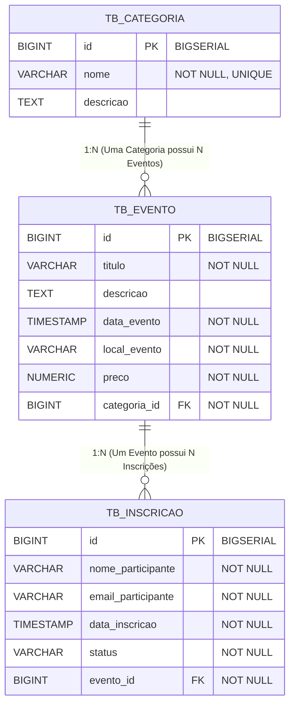

# 🎪 API de Gerenciamento de Eventos e Inscrições (`eventos-api`)

> **Projeto Acadêmico de Banco de Dados e Desenvolvimento Backend com Java, Spring Boot 3 e PostgreSQL.**

---

## 📌 1. Domínio Escolhido e Justificativa

* **Domínio**: Sistema de Gerenciamento de Eventos e Inscrições de Participantes.
* **Justificativa**: O domínio de gerenciamento de eventos foi selecionado por ser um tema extremamente realista, intuitivo para apresentação em banca/sala de aula e ideal para demonstrar o modelo relacional de banco de dados com integridade referencial de chaves estrangeiras.
* **Entidades Principais**:
  1. `tb_categoria`: Categorias temáticas dos eventos (ex: *Tecnologia*, *Negócios*, *Cultura*).
  2. `tb_evento`: Eventos cadastrados na plataforma com data, local, preço e chave estrangeira para `tb_categoria`.
  3. `tb_inscricao`: Inscrições de participantes associadas a um determinado `tb_evento`.

---

## 🏛️ 2. Modelo Relacional do Banco de Dados

### Diagrama Entidade-Relacionamento (Mermaid)



### Relacionamentos 1:N (Um-para-Muitos) Explícitos:
- **`tb_categoria` 1:N `tb_evento`**: Uma categoria pode agrupar múltiplos eventos. Mapeado via `@OneToMany` em `Categoria` e `@ManyToOne` em `Evento`.
- **`tb_evento` 1:N `tb_inscricao`**: Um evento pode receber múltiplas inscrições de participantes. Mapeado via `@OneToMany` em `Evento` e `@ManyToOne` em `Inscricao`.

---

## 🚀 3. Como Rodar o Projeto

### Pré-requisitos
* Java 17 ou superior instalado.
* PostgreSQL rodando na porta `5432` com banco `db_eventos` criado (ou utilize o banco H2 embutido para testes).
* Maven 3.8+ instalado.

### Configuração do Banco de Dados (PostgreSQL)
Abra o terminal do PostgreSQL (`psql`) ou PgAdmin e execute:
```sql
CREATE DATABASE db_eventos;
```
As credenciais padrão no `application.properties` são:
* URL: `jdbc:postgresql://localhost:5432/db_eventos`
* Usuário: `postgres`
* Senha: `postgres`

### Executando com Maven
No terminal, dentro da pasta do projeto (`eventos-api`):
```bash
# Compilar e executar a aplicação
mvn spring-boot:run
```
A API estará acessível em: `http://localhost:8080`

### Console do Banco H2 (Modo Dev / Teste)
Caso deseje testar sem o PostgreSQL rodando localmente, ative o perfil H2 e acesse:
* URL: `http://localhost:8080/h2-console`
* JDBC URL: `jdbc:h2:mem:db_eventos`

---

## 🛠️ 4. Lista Completa de Endpoints REST

### 🏷️ Categorias (`/api/categorias`)

| Método | Rota | Descrição | Payload (Body) Exemplo |
| :--- | :--- | :--- | :--- |
| **GET** | `/api/categorias` | Lista todas as categorias | N/A |
| **GET** | `/api/categorias/{id}` | Busca categoria por ID | N/A |
| **POST** | `/api/categorias` | Cria uma nova categoria | `{"nome": "Educação", "descricao": "Cursos e Palestras"}` |
| **PUT** | `/api/categorias/{id}` | Atualiza categoria existente | `{"nome": "Educação Tech", "descricao": "Workshops de TI"}` |
| **DELETE** | `/api/categorias/{id}` | Remove uma categoria | N/A |

### 📅 Eventos (`/api/eventos`)

| Método | Rota | Descrição | Payload (Body) Exemplo |
| :--- | :--- | :--- | :--- |
| **GET** | `/api/eventos` | Lista todos os eventos | N/A |
| **GET** | `/api/eventos/{id}` | Busca evento por ID | N/A |
| **GET** | `/api/eventos/categoria/{categoriaId}` | Lista eventos por categoria | N/A |
| **POST** | `/api/eventos` | Cria um novo evento | `{"titulo": "Hackathon 2026", "descricao": "Desafio Dev", "dataEvento": "2026-11-10T08:00:00", "localEvento": "Lab 3", "preco": 0.00, "categoriaId": 1}` |
| **PUT** | `/api/eventos/{id}` | Atualiza evento | `{"titulo": "Hackathon 2026 - Edição Final", "descricao": "Desafio Dev de 48h", "dataEvento": "2026-11-10T08:00:00", "localEvento": "Auditório Principal", "preco": 20.00, "categoriaId": 1}` |
| **DELETE** | `/api/eventos/{id}` | Remove um evento | N/A |

### 📝 Inscrições (`/api/inscricoes`)

| Método | Rota | Descrição | Payload (Body) Exemplo |
| :--- | :--- | :--- | :--- |
| **GET** | `/api/inscricoes` | Lista todas as inscrições | N/A |
| **GET** | `/api/inscricoes/{id}` | Busca inscrição por ID | N/A |
| **GET** | `/api/inscricoes/evento/{eventoId}` | Lista inscrições de um evento | N/A |
| **POST** | `/api/inscricoes` | Realiza inscrição em evento | `{"nomeParticipante": "Lucas Mendes", "emailParticipante": "lucas@email.com", "eventoId": 1}` |
| **PUT** | `/api/inscricoes/{id}` | Atualiza dados/status da inscrição | `{"nomeParticipante": "Lucas Mendes", "emailParticipante": "lucas@email.com", "status": "CONFIRMADA", "eventoId": 1}` |
| **DELETE** | `/api/inscricoes/{id}` | Cancela/Deleta inscrição | N/A |

### 📊 Relatórios Agregados com Native Query (`/api/relatorios`)

| Método | Rota | Descrição | Tipo de SQL Utilizado |
| :--- | :--- | :--- | :--- |
| **GET** | `/api/relatorios/agregacao-categoria` | Retorna total de inscrições, total de eventos e faturamento estimado por categoria | **SQL Puro Nativo** com `COUNT`, `SUM`, `COALESCE`, `LEFT JOIN` e `GROUP BY` |
| **GET** | `/api/relatorios/estatisticas-eventos` | Retorna total de inscritos, confirmados e preço médio por evento | **SQL Puro Nativo** com `COUNT`, `SUM(CASE)`, `AVG` e `GROUP BY` |

---

## 🎯 5. Checklist de Requisitos Obrigatórios Atendidos

| Requisito Obrigatório | Status | Onde está Implementado no Código |
| :--- | :---: | :--- |
| **1. Endpoints REST completos de cadastro (CRUD)** | ✅ ATENDIDO | `CategoriaController.java`, `EventoController.java` e `InscricaoController.java` contêm todos os verbos HTTP: `GET`, `POST`, `PUT` e `DELETE`. |
| **2. Mínimo de 3 tabelas no banco com relacionamentos entre si** | ✅ ATENDIDO | 3 tabelas criadas: `tb_categoria`, `tb_evento` e `tb_inscricao`. Script em [`schema.sql`](file:///c:/Users/Henrique/Desktop/BD_TRABALHO/eventos-api/schema.sql). |
| **3. Pelo menos 1 relacionamento do tipo 1:N mapeado com `@OneToMany` / `@ManyToOne`** | ✅ ATENDIDO | Mapeado em [`Categoria.java`](file:///c:/Users/Henrique/Desktop/BD_TRABALHO/eventos-api/src/main/java/com/trabalho/eventos/model/Categoria.java) (`@OneToMany`), [`Evento.java`](file:///c:/Users/Henrique/Desktop/BD_TRABALHO/eventos-api/src/main/java/com/trabalho/eventos/model/Evento.java) (`@ManyToOne` e `@OneToMany`) e [`Inscricao.java`](file:///c:/Users/Henrique/Desktop/BD_TRABALHO/eventos-api/src/main/java/com/trabalho/eventos/model/Inscricao.java) (`@ManyToOne`). |
| **4. Pelo menos 1 endpoint de agregação usando Native Query (`@Query(nativeQuery = true)`) em SQL puro** | ✅ ATENDIDO | Implementado em [`CategoriaRepository.java`](file:///c:/Users/Henrique/Desktop/BD_TRABALHO/eventos-api/src/main/java/com/trabalho/eventos/repository/CategoriaRepository.java) via método `gerarRelatorioAgregadoNativeQuery()` e exposto no endpoint `GET /api/relatorios/agregacao-categoria` em [`RelatorioController.java`](file:///c:/Users/Henrique/Desktop/BD_TRABALHO/eventos-api/src/main/java/com/trabalho/eventos/controller/RelatorioController.java). |

---

## 📂 6. Estrutura das Pastas do Projeto

```
eventos-api/
├── pom.xml
├── README.md
├── schema.sql
├── data.sql
├── database_diagram.mermaid
├── src/
│   ├── main/
│   │   ├── java/
│   │   │   └── com/
│   │   │       └── trabalho/
│   │   │           └── eventos/
│   │   │               ├── EventosApiApplication.java
│   │   │               ├── controller/
│   │   │               │   ├── CategoriaController.java
│   │   │               │   ├── EventoController.java
│   │   │               │   ├── InscricaoController.java
│   │   │               │   └── RelatorioController.java
│   │   │               ├── service/
│   │   │               │   ├── CategoriaService.java
│   │   │               │   ├── EventoService.java
│   │   │               │   └── InscricaoService.java
│   │   │               ├── repository/
│   │   │               │   ├── CategoriaRepository.java
│   │   │               │   ├── EventoRepository.java
│   │   │               │   └── InscricaoRepository.java
│   │   │               ├── model/
│   │   │               │   ├── Categoria.java
│   │   │               │   ├── Evento.java
│   │   │               │   └── Inscricao.java
│   │   │               ├── dto/
│   │   │               │   ├── CategoriaDTO.java
│   │   │               │   ├── EventoDTO.java
│   │   │               │   ├── InscricaoDTO.java
│   │   │               │   ├── CategoriaRelatorioProjection.java
│   │   │               │   └── EventoEstatisticaProjection.java
│   │   │               └── exception/
│   │   │                   ├── ResourceNotFoundException.java
│   │   │                   └── GlobalExceptionHandler.java
│   │   └── resources/
│   │       ├── application.properties
│   │       ├── schema.sql
│   │       └── data.sql
│   └── test/
│       └── java/
│           └── com/
│               └── trabalho/
│                   └── eventos/
│                       ├── CategoriaControllerTest.java
│                       ├── EventoControllerTest.java
│                       └── InscricaoControllerTest.java
```
